<p align="center">
  <a href="https://community.vaunt.dev/board/coderxsle/achievements">
    
  </a>
</p>

<h1 align="center">📚 Flutter Web Admin 后台管理系统</h1>

<p align="center">
  基于 Serverpod + Flutter + PostgreSQL + Redis 构建的全栈后台管理系统
</p>

<p align="center">
  
  
  
  
  
</p>

---

## 🌐 在线演示

<p align="center">
  <a href="http://103.215.82.63:18000/" target="_blank">
    
  </a>
</p>

<p align="center">
  <b>演示地址：</b> <a href="http://103.215.82.63:18000/" target="_blank">http://103.215.82.63:18000/</a>
</p>

---

## 📸 系统截图

<table>
  <tr>
    <td align="center">
      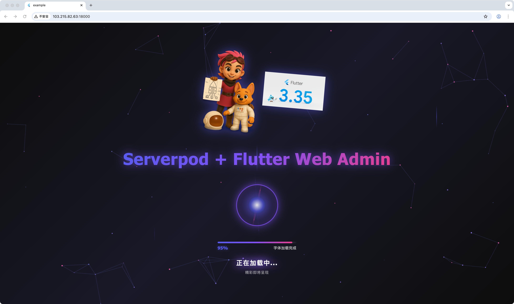
      <br/>
      <b>加载页面</b>
    </td>
    <td align="center">
      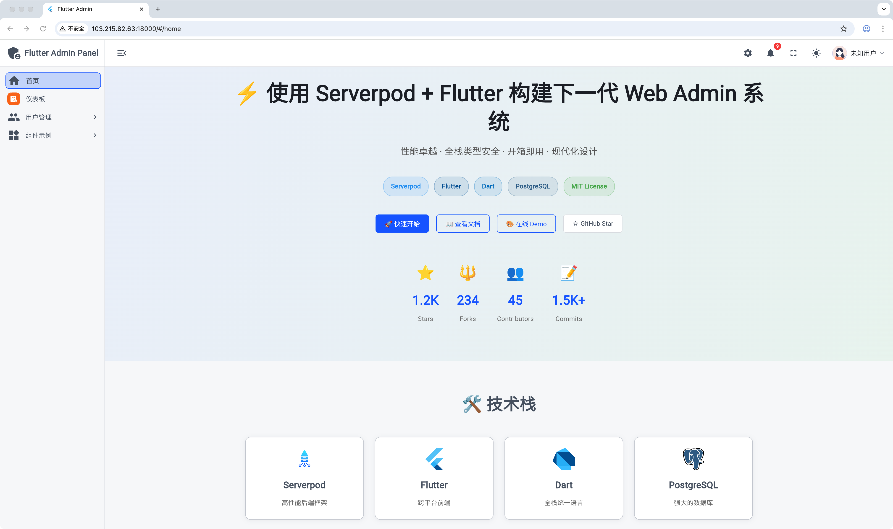
      <br/>
      <b>首页 - 展开侧边栏</b>
    </td>
  </tr>
  <tr>
    <td align="center">
      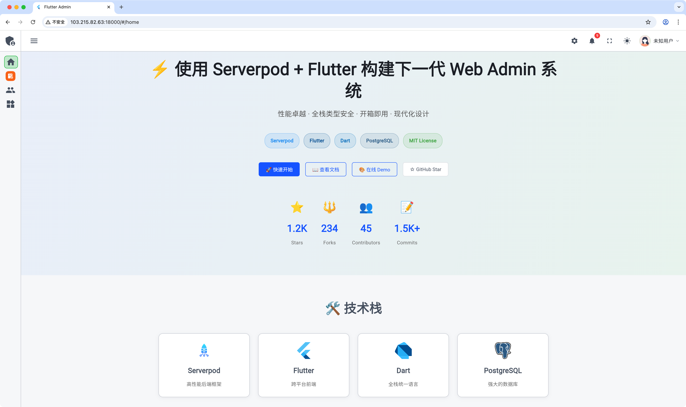
      <br/>
      <b>首页 - 收起侧边栏</b>
    </td>
    <td align="center">
      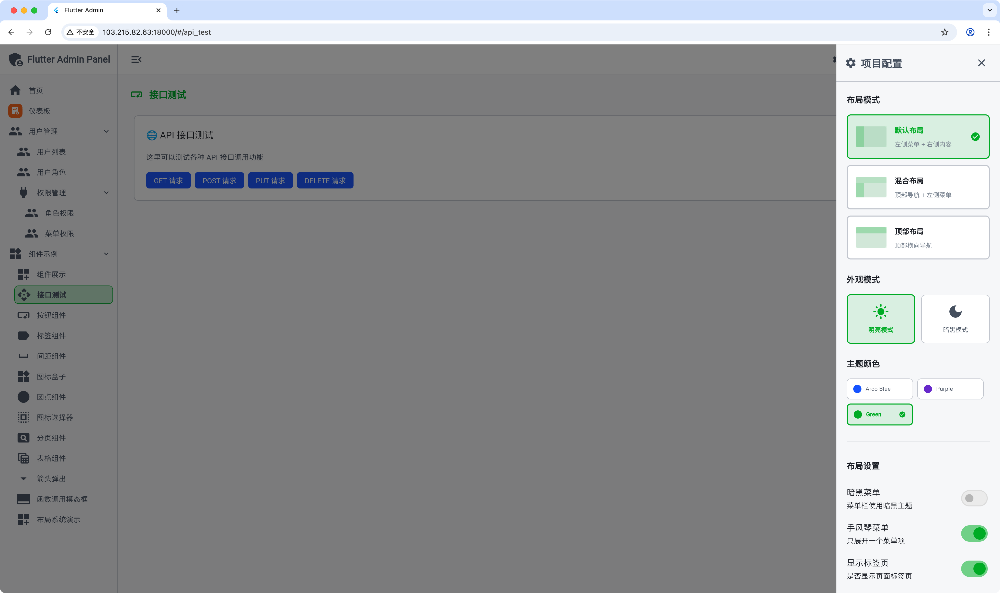
      <br/>
      <b>API 测试 & 主题配置</b>
    </td>
  </tr>
  <tr>
    <td align="center">
      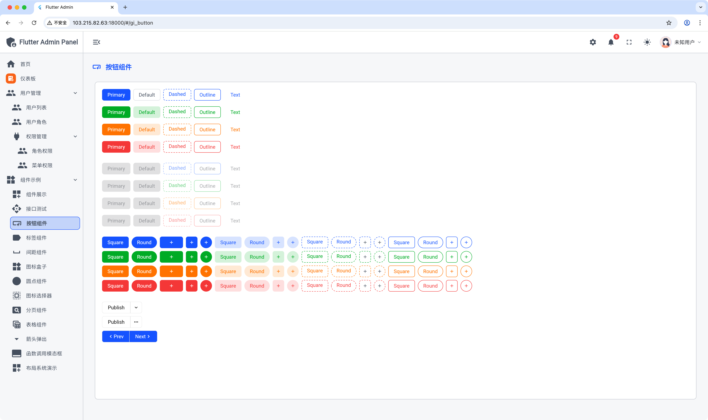
      <br/>
      <b>按钮组件展示</b>
    </td>
    <td align="center">
      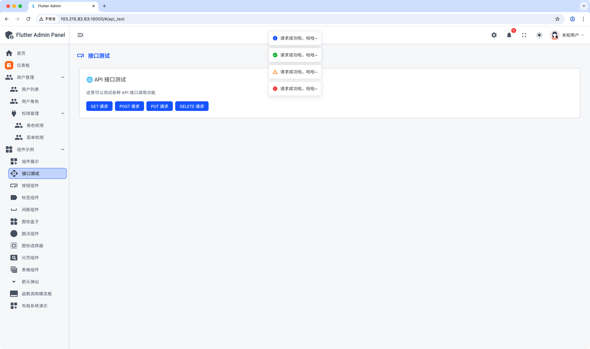
      <br/>
      <b>消息通知组件</b>
    </td>
  </tr>
  <tr>
    <td align="center">
      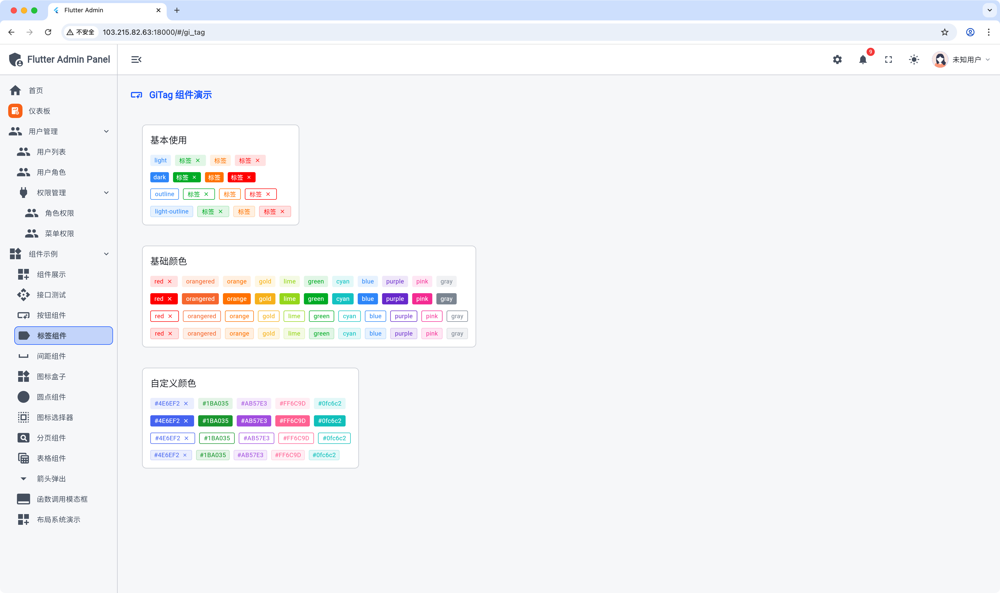
      <br/>
      <b>GiTag 标签组件</b>
    </td>
    <td align="center">
      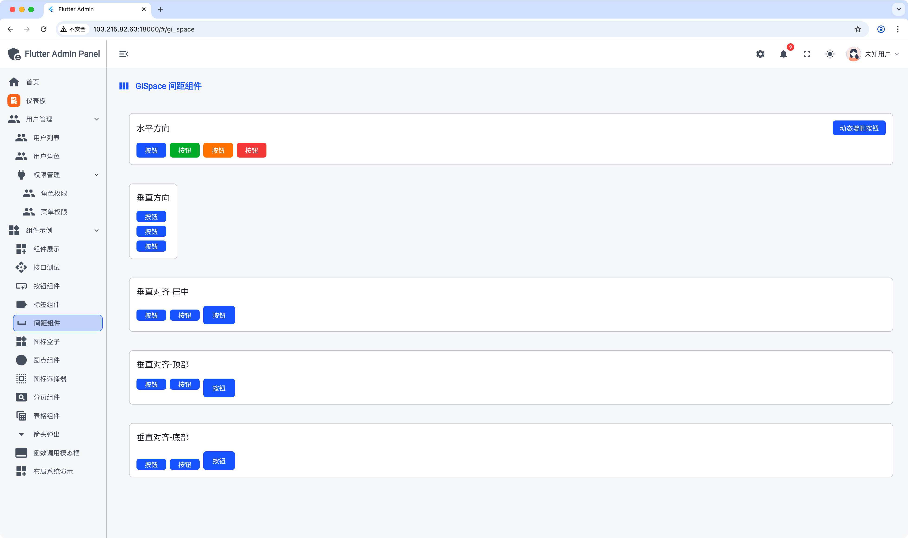
      <br/>
      <b>GiSpace 间距组件</b>
    </td>
  </tr>
  <tr>
    <td align="center">
      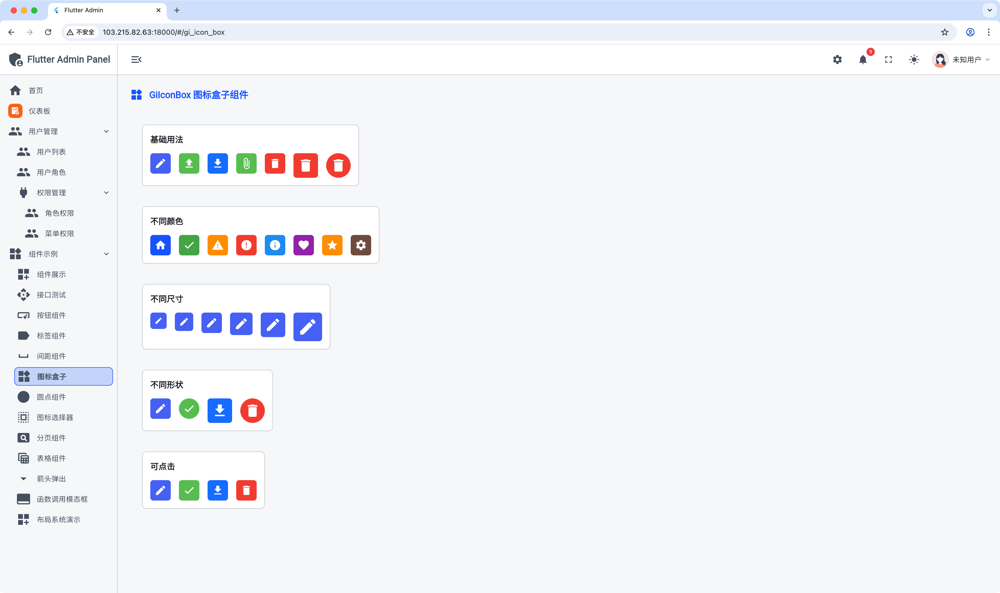
      <br/>
      <b>GiIconBox 图标盒子</b>
    </td>
    <td align="center">
      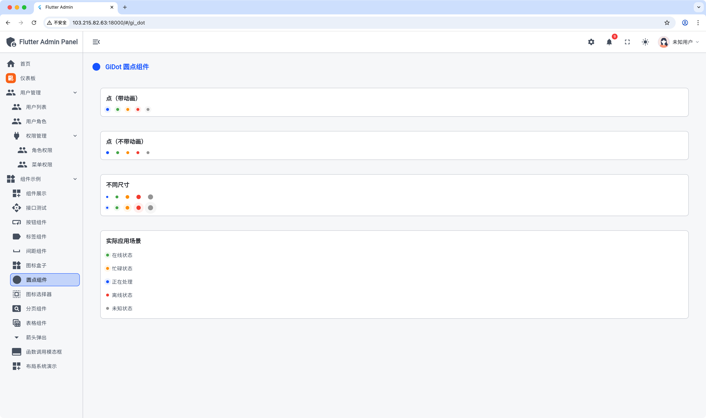
      <br/>
      <b>GiDot 圆点组件</b>
    </td>
  </tr>
  <tr>
    <td align="center">
      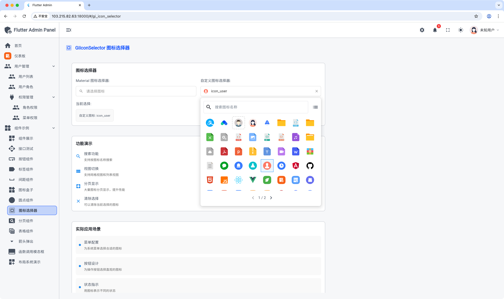
      <br/>
      <b>GiIconSelector 图标选择器</b>
    </td>
    <td align="center">
      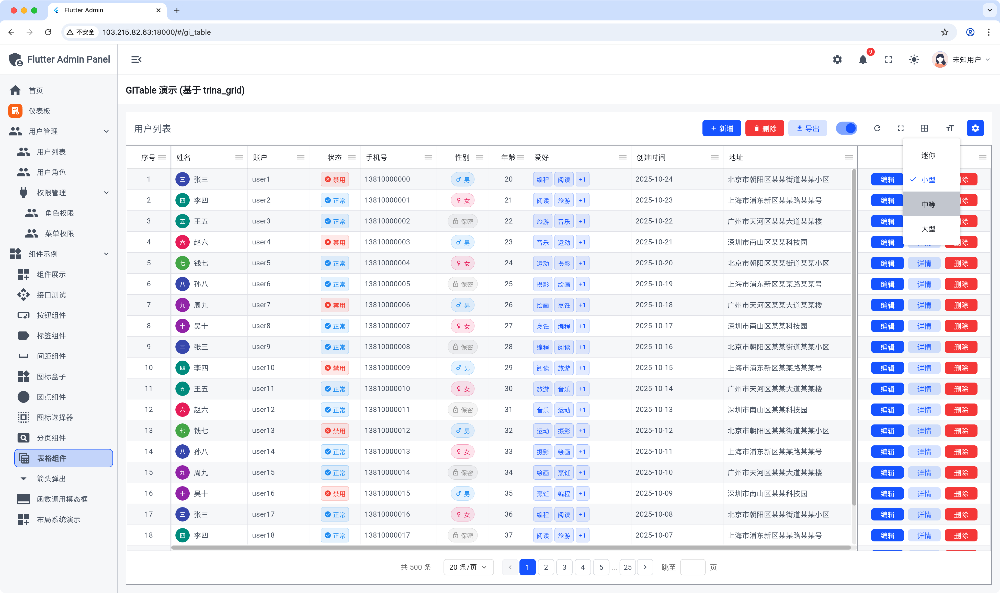
      <br/>
      <b>GiTable 数据表格</b>
    </td>
  </tr>
</table>

---

## 📖 项目简介

这是一个现代化的全栈后台管理系统，采用 Serverpod 作为后端框架，Flutter Web 作为前端，PostgreSQL 作为主数据库，Redis 作为缓存层。项目使用 Monorepo 架构进行管理，通过 Melos 工具实现多包协同开发。

### ✨ 核心特性

- 🚀 **高性能后端**：基于 Serverpod 框架，提供 RESTful API 和实时通信能力
- 💎 **现代化前端**：使用 Flutter Web 构建响应式管理界面
- 🗄️ **强大的数据层**：PostgreSQL 关系型数据库 + Redis 缓存
- 📦 **Monorepo 架构**：使用 Melos 管理多个相关包
- 🔄 **类型安全**：前后端共享数据模型，自动生成客户端代码
- 🐳 **容器化部署**：支持 Docker 和 Docker Compose 一键部署
- 🔐 **安全可靠**：完善的身份认证和权限管理系统

---

## 🚀 快速开始
### 安装依赖

1. **克隆项目**

```bash
git clone <repository-url>
cd flutter_web_admin
```

2. **安装 Melos**

```bash
dart pub global activate melos
```

3. **初始化项目**

```bash
# 安装所有包的依赖
melos bootstrap
```

### 数据库配置

1. **创建 PostgreSQL 数据库**

```bash
createdb flutter_web_admin
```

### 启动项目

#### 方式一：本地开发

1. **启动后端服务**

```bash
cd flutter_web_admin_server
dart bin/main.dart
```

后端服务将运行在 `http://localhost:8080`

2. **启动前端应用**

```bash
cd flutter_web_admin_admin
flutter run -d chrome
```

前端应用将在浏览器中打开

### 数据库模型

本项目使用 Serverpod 的 ORM 系统进行数据库建模：

- [数据库模型文档](https://docs.serverpod.dev/concepts/database/models)
- [数据库关系文档](https://docs.serverpod.dev/concepts/database/relations/one-to-one)

### 生成客户端代码

当修改了服务端模型后，需要重新生成客户端代码：

```bash
cd flutter_web_admin_server
serverpod generate
```
---

## 📝 文档

- [Serverpod 官方文档](https://docs.serverpod.dev/)
- [Flutter 官方文档](https://docs.flutter.dev/)
- [项目开发进度](flutter_web_admin_admin/docs/PROJECT_PROGRESS.md)
- [系统管理实现说明](flutter_web_admin_admin/docs/SYSTEM_MANAGEMENT_IMPLEMENTATION.md)
- [Serverpod 版本管理](SERVERPOD_VERSION_MANAGEMENT.md)

---

## 🤝 参与贡献

欢迎贡献代码、报告问题或提出建议！

1. Fork 本仓库
2. 创建特性分支 (`git checkout -b feature/AmazingFeature`)
3. 提交更改 (`git commit -m 'Add some AmazingFeature'`)
4. 推送到分支 (`git push origin feature/AmazingFeature`)
5. 提交 Pull Request

---

## 📄 许可证

请查看 [LICENSE](LICENSE) 文件了解详情

---

## 📧 联系方式

如有问题或建议，欢迎通过以下方式联系：

- 📮 提交 Issue
- 💬 **添加微信**：扫描下方二维码，直接与作者一对一沟通

<p align="center">
  
</p>

<p align="center">
  <i>扫一扫上面的二维码图案，加我为朋友</i>
</p>

---

<p align="center">
  Made with ❤️ by coderxslee
</p>
