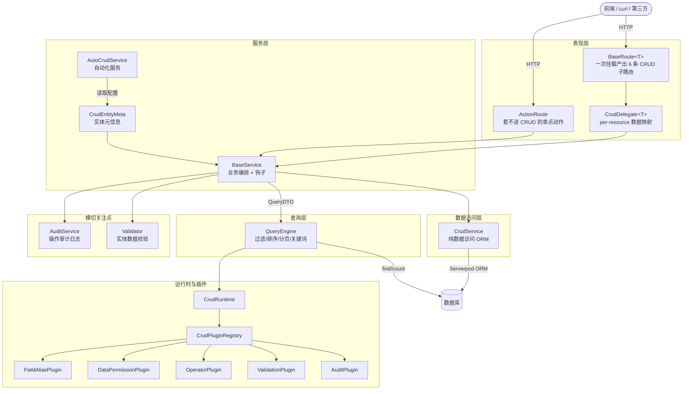
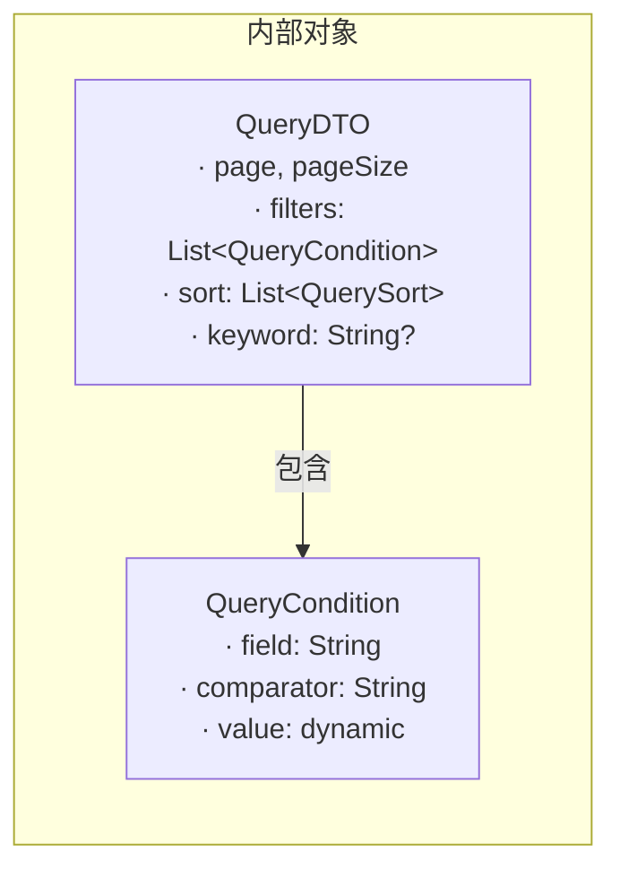
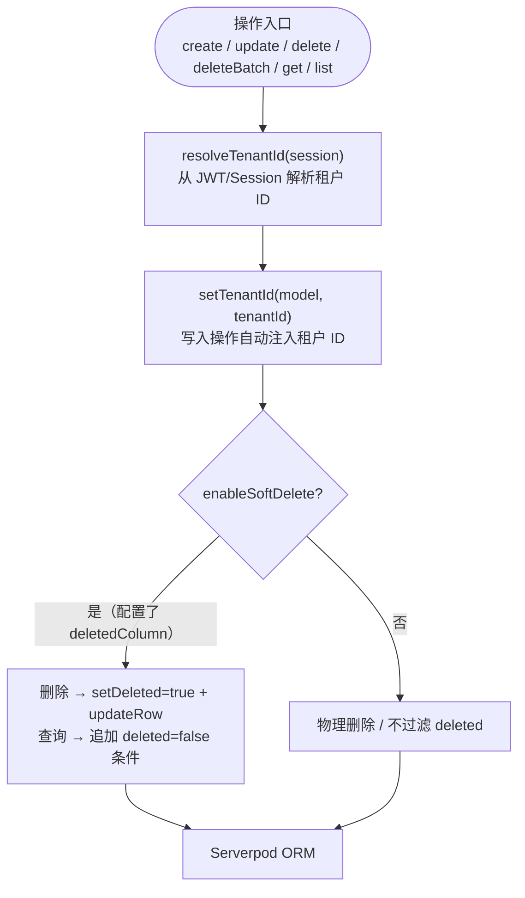
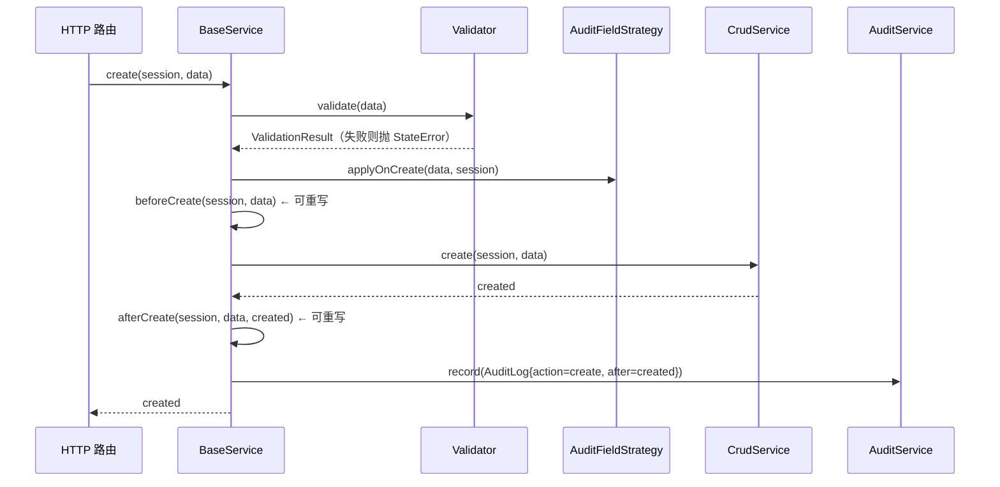
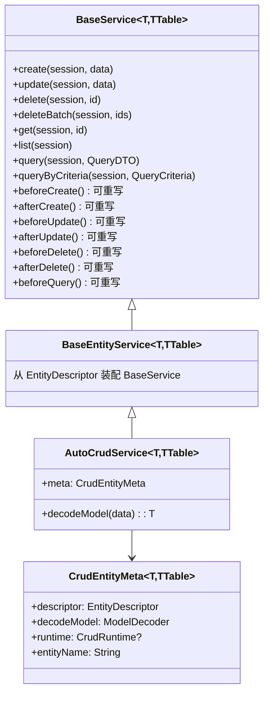
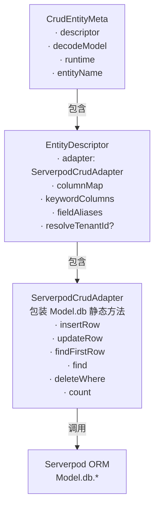
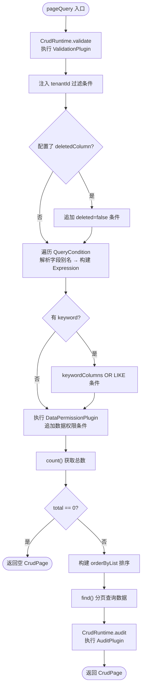
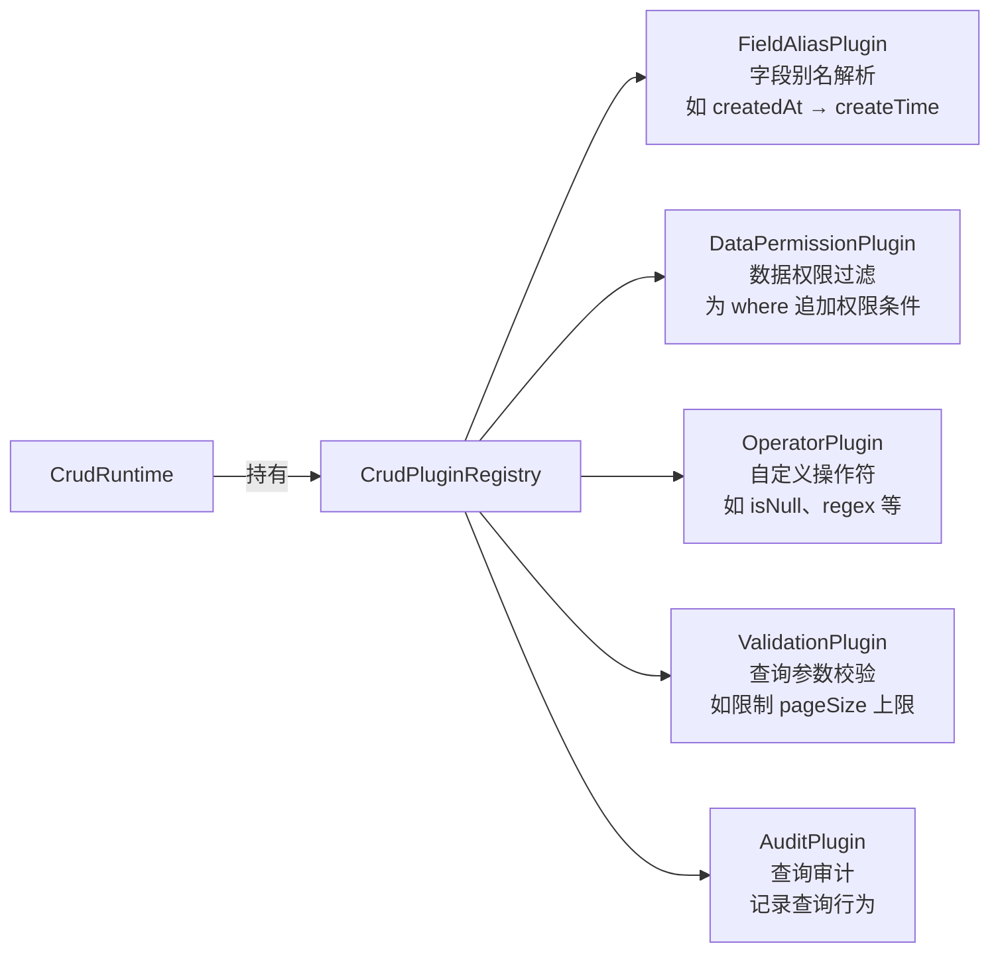

# serverpod_crud

基于 [Serverpod](https://serverpod.dev) 的通用 CRUD 框架，提供多租户隔离、软删除、分页查询、过滤排序、审计日志、校验器、运行时插件等能力，让你用极少的代码完成实体的增删改查接入。

---

## 目录

- [包结构](#包结构)
- [架构总览](#架构总览)
- [各层详解](#各层详解)
  - [数据模型层](#数据模型层)
  - [数据访问层 CrudService](#数据访问层-crudservice)
  - [业务服务层 BaseService](#业务服务层-baseservice)
  - [自动服务层 AutoCrudService](#自动服务层-autocrudservice)
  - [元信息 CrudEntityMeta](#元信息-crudentitymeta)
  - [查询引擎 QueryEngine](#查询引擎-queryengine)
  - [运行时与插件 CrudRuntime](#运行时与插件-crudruntime)
  - [审计层](#审计层)
  - [校验层](#校验层)
- [快速接入](#快速接入)
- [查询条件参考](#查询条件参考)

---

## 包结构

```
serverpod_crud/lib/src/
├── core/
│   ├── crud_types.dart         # 通用函数类型别名（InsertRow、FindRows 等）
│   ├── crud_models.dart        # CrudPage / CrudBatchResult
│   └── exceptions.dart         # CRUD 异常类型
├── crud/
│   ├── crud_service.dart       # 纯数据访问层（租户/软删/基础 CRUD）
│   ├── base_service.dart       # 业务编排层（钩子/审计/校验/query）
│   ├── auto_crud_service.dart  # 基于 CrudEntityMeta 的自动服务
│   └── crud_entity_meta.dart   # 实体元信息聚合对象
├── models/query/
│   ├── query_dto.dart          # 内部查询 DTO
│   ├── query_condition.dart    # 内部过滤条件（value 为 dynamic）
│   └── query_sort.dart         # 排序条件
├── query/
│   └── query_engine.dart       # 查询引擎（过滤/排序/分页/关键词/插件）
├── web/                        # REST 表现层（relic Route）
│   ├── base_rest_route.dart    # 一次挂载产出 6 条 CRUD 子路由
│   ├── crud_options.dart          # 资源级配置（审计 / 默认排序 / 字段别名）
│   ├── auto_crud_delegate.dart  # 包 BaseService 的现成 delegate
│   ├── rest_crud_delegate.dart # per-resource 的数据映射接口
│   ├── rest_action.dart        # get/post/put/delete 动作工厂
│   ├── rest_action_route.dart  # 单点业务动作路由
│   ├── rest_crud.dart          # 表现层聚合 export
│   ├── rest_envelope_builder.dart   # 响应信封收口点
│   ├── rest_exception.dart     # 带 httpStatus 与业务码的失败语义
│   ├── rest_page.dart          # 协议无关的分页载荷
│   ├── rest_payload.dart       # JSON 编码工具
│   ├── rest_request_extension.dart  # Request 的 query/body 读取扩展
│   └── serverpod_rest_crud.dart     # Serverpod 挂载扩展
├── audit/
│   ├── audit_log.dart          # 审计日志记录体
│   └── audit_service.dart      # 审计服务接口
├── validation/
│   ├── validator.dart          # 校验器抽象
│   └── validation_result.dart  # 校验结果
├── plugins/
│   ├── query_mapper_plugin.dart     # 查询映射插件接口
│   ├── operator_plugin.dart         # 自定义过滤操作符插件
│   ├── field_alias_plugin.dart      # 字段别名解析插件
│   ├── data_permission_plugin.dart  # 数据权限过滤插件
│   ├── validation_plugin.dart       # 查询参数校验插件
│   ├── audit_plugin.dart            # 查询审计插件
│   ├── contains_operator_plugin.dart    # contains 操作符
│   ├── noop_data_permission_plugin.dart # 空数据权限策略
│   └── query_audit_log_plugin.dart      # 可注入写入器的查询审计
├── runtime/
│   ├── crud_config.dart        # 框架级全局配置（每页上限唯一出处）
│   ├── crud_runtime.dart       # 运行时上下文（插件统一入口）
│   └── plugin_registry.dart    # 插件注册表
└── extensions/
    └── session_extension.dart  # Session 的租户扩展
```

---

## 架构总览



---

## 各层详解

### 数据模型层

查询只有**一套内部对象** —— `QueryDTO`。表现层负责把请求参数解成它（本项目的
`rest_delegate_utils.dart` 就是这么做的），`QueryEngine` 再据此生成
where / order / limit / offset。



| 对象 | 用途 | `value` 类型 |
|------|------|------------|
| `QueryDTO` | 服务层内部查询对象，有 `copyWith` | — |
| `QueryCondition` | `QueryDTO` 中的过滤项 | `dynamic`（已是真实类型） |
| `QuerySort` | 排序条件 | — |

---

### 数据访问层 CrudService

`CrudService<T, TTable>` 是纯数据库操作层，**所有操作自动注入多租户隔离和软删除约束**，不含任何业务逻辑。



| 方法 | 说明 |
|------|------|
| `create(session, data)` | 插入，自动注入 tenantId，软删时置 deleted=false |
| `update(session, data)` | 更新，校验记录存在且属于当前租户 |
| `delete(session, id)` | 软删：标记 deleted=true；硬删：物理删除 |
| `deleteBatch(session, ids)` | 批量删除，返回实际成功数量 |
| `get(session, id)` | 按 ID 查单条（自动加租户+软删过滤） |
| `list(session)` | 查当前租户全部记录 |

> 分页查询统一走 `QueryEngine.pageQuery()`（见 [查询引擎 QueryEngine](#查询引擎-queryengine)），
> `CrudService` 本身只提供单表 CRUD 原语。

---

### 业务服务层 BaseService

`BaseService<T, TTable>` 是核心业务编排层，在 `CrudService` 之上提供**生命周期钩子、审计日志、数据校验、审计字段自动填充**。



**可重写的生命周期钩子：**

| 钩子 | 触发时机 | 典型用途 |
|------|----------|----------|
| `beforeCreate` | 插入数据库之前 | 填充默认值、权限检查 |
| `afterCreate` | 插入成功之后 | 发送通知、同步缓存 |
| `beforeUpdate` | 更新数据库之前 | 变更校验 |
| `afterUpdate` | 更新成功之后 | 清除缓存 |
| `beforeDelete` | 删除之前 | 关联数据检查 |
| `afterDelete` | 删除成功之后 | 清理关联数据 |
| `beforeQuery` | `query()` 执行之前 | 动态注入额外过滤条件 |

```dart
class OrderService extends AutoCrudService<Order, OrderTable> {
  OrderService() : super(OrderMeta.instance);

  @override
  Future<void> beforeCreate(Session session, Order data) async {
    data.status = 'pending'; // 创建前设置默认状态
  }

  @override
  Future<void> beforeQuery(Session session, QueryDTO query) async {
    // 普通用户只能查自己的订单
    // 可在此向 query 注入额外条件
  }
}
```

---

### 自动服务层 AutoCrudService

`AutoCrudService<T, TTable>` 继承自 `BaseEntityService → BaseService`，额外从 `CrudEntityMeta` 读取模型解码器，使业务代码做到**零样板**。



---

### 元信息 CrudEntityMeta

`CrudEntityMeta<T, TTable>` 聚合了一个实体运行 CRUD 所需的全部配置，是 `AutoCrudService` 的核心依赖。

| 字段 | 类型 | 说明 |
|------|------|------|
| `descriptor` | `EntityDescriptor<T, TTable>` | 数据库适配器 + 字段映射 + 关键词列 + 字段别名 + 租户解析 |
| `decodeModel` | `T Function(dynamic)` | 将请求体（JSON/Map）解码为实体模型 |
| `runtime` | `CrudRuntime?` | 运行时插件上下文，可按实体独立配置 |
| `entityName` | `String` | 实体标识名，用于日志/审计 |

`EntityDescriptor` 内部包含 `ServerpodCrudAdapter`，将 `Model.db.find()`、`Model.db.insertRow()` 等静态方法包装为可注入的函数类型，使框架与具体实体类解耦。



---

### 查询引擎 QueryEngine

`QueryEngine.pageQuery()` 是查询的核心，统一处理分页、过滤、排序、关键词、插件扩展。



**内置过滤操作符：**

| 操作符 | 说明 | `value` 示例 |
|--------|------|-------------|
| `eq` | 等于 | `123` / `"active"` |
| `ne` | 不等于 | `0` |
| `like` | 模糊匹配（自动加 `%`） | `"john"` |
| `ilike` | 大小写不敏感模糊匹配 | `"John"` |
| `in` | 包含在集合中 | `[1, 2, 3]` |
| `between` | 范围 | `[10, 100]` |
| `gt` / `gte` | 大于 / 大于等于 | `18` |
| `lt` / `lte` | 小于 / 小于等于 | `100` |
| 自定义 | 通过 `OperatorPlugin` 扩展 | 任意 |

---

### 运行时与插件 CrudRuntime

`CrudRuntime` 是插件系统的统一入口，持有 `CrudPluginRegistry`，在查询时依次调用各插件。



| 插件 | 接口 | 触发时机 |
|------|------|----------|
| `FieldAliasPlugin` | `resolveField(field, aliases)` | 每次解析过滤/排序字段名时 |
| `DataPermissionPlugin` | `buildFilter(session, table)` | 构建 where 条件时，追加权限过滤 |
| `OperatorPlugin` | `name` + `build(column, value)` | 遇到未知操作符时依次尝试 |
| `ValidationPlugin` | `validate(query)` | `pageQuery` 入口，校验查询参数 |
| `AuditPlugin` | `onQuery(session, query)` | 查询成功后记录行为 |

> 另有 `QueryMapperPlugin`（`CrudRuntime.mapQuery` 用），把任意外部请求对象转成
> `QueryDTO`。本项目没有装配它 —— 表现层自己解参数。

---

### 审计层

`AuditService<T>` 是审计持久化的抽象接口，默认使用空实现 `NoopAuditService`（不落库）。

⚠️ `NoopAuditService` **不是完全静默**：丢弃审计时会用 `LogLevel.warning` 打一条日志
（同一实体类型只打一次）。这是刻意留的「漏接可发现性」—— 曾经有资源忘了注入真实实现，
表现是审计表**一行都没有、却没有任何报错**。

```dart
// 自定义审计：将日志写入数据库
class DbAuditService<T> extends AuditService<T> {
  @override
  Future<void> record(Session session, AuditLog<T> log) async {
    await AuditRecord.db.insertRow(session, AuditRecord(
      action: log.action.name,
      entityId: log.entityId,
      timestamp: log.timestamp,
    ));
  }
}
```

`AuditLog<T>` 字段：

| 字段 | 说明 |
|------|------|
| `action` | `create` / `update` / `delete` / `query` |
| `timestamp` | 操作时间 |
| `actorId` | 操作者 ID（可选） |
| `entityId` | 实体主键（可选） |
| `before` | 变更前快照（可选） |
| `after` | 变更后快照（可选） |

---

### 校验层

`Validator<T>` 是校验的抽象接口，框架提供 `RuleBasedValidator` 开箱即用。

```dart
final validator = RuleBasedValidator<Book>([
  (data) => data.name.isEmpty ? ValidationError('name', '书名不能为空') : null,
  (data) => data.originalPrice <= 0 ? ValidationError('price', '价格必须大于 0') : null,
]);
```

在 `BaseService` 中注入：

```dart
class BookService extends AutoCrudService<Book, BookTable> {
  BookService() : super(BookMeta.instance);

  // 通过构造注入（需扩展 BaseService 构造），或在 beforeCreate/beforeUpdate 中手动调用
}
```

---

## 快速接入

### 路线一：零业务规则 —— 不写 delegate

表结构与生成模型一致、不需要业务规则时，直接用 `AutoCrudDelegate<T>`。
表类型在运行期由 `getTableForType(T)` 反查，所以只写一个类型参数：

```dart
registerResource<SysDictData>(
  pod,
  '/api/dictData',
  AutoCrudDelegate<SysDictData>(),
);
```

⚠️ **自动装配出来的 Service 不带审计**：`BaseService` 的 `auditService` 默认是
`NoopAuditService`，所以不显式给的话，`create` / `update` / `delete` **一条日志都不会落库**
（只会在首次丢弃时打一条 warning）。补审计只需一个参数：

```dart
registerResource<Resource>(
  pod,
  '/api/resource',
  AutoCrudDelegate<Resource>(
    auditService: const DbAuditService<Resource>(type: 'resource'),
  ),
);
```

⚠️ `service` 与 `auditService` **只能给一个**：传了 `service` 时审计要配在那个 Service 里，
再给 `auditService` 会被静默忽略 —— 所以框架直接抛 `ArgumentError`，不咽下去。

`registerResource` 是业务项目侧的一行薄封装，只负责**统一传信封** —— 漏传会退回中立信封（`{message, data}`，**没有 `code`**），前端解析会静默失灵：

```dart
void registerResource<T extends TableRow>(
  Serverpod pod,
  String path,
  CrudDelegate<T> delegate, {
  bool enableCreate = true,
}) {
  pod.webServer.addRoute(
    BaseRoute<T>(
      delegate: delegate,
      envelope: const ServerpodEnvelopeBuilder(),
      enableCreate: enableCreate,
    ),
    path,
  );
}
```

**一次挂载产出 6 条字面子路径**（团队式约定，不是 REST 原生动词那套）：

| 方法 | 子路径 | 说明 |
|---|---|---|
| `GET` | `/getList` | 列表。过滤条件全走 query，分页 `page` + `pageSize` |
| `GET` | `/getDetail` | 详情。**id 走 query**（`?id=1`），不是路径参数 |
| `POST` | `/add` | 新增，成功 **201**；`enableCreate: false` 时**不注册** → 404 |
| `POST` | `/update` | 更新（PATCH 语义），body 平铺且**自带 `id`** |
| `POST` | `/delete` | 删除单条，body `{"id":1}` |
| `POST` | `/deleteBatch` | 批量删除，body `{"ids":[…]}`，返回 `CrudBatchResult` |

⚠️ 挂载点下**没有 `:id` 段**，所以 `GET /api/user/5` 是 **404**；要看详情写 `GET /api/user/getDetail?id=5`。

表用非标准字段名时只需覆盖差异：

```dart
AutoCrudDelegate<Resource>(
  tenantIdField: 'organizationId',
  deletedField: 'archived',
  keywordFields: const ['name', 'code'],
  fieldAliases: const {'createdAt': 'createTime'},
);
```

### 路线二：有业务规则 —— 用 `actionList` 覆写

`actionList` 里的路径与框架内建的 CRUD 子路径**同名即替代**：某个 `方法 + 路径`（如 `POST /deleteBatch`）在 `actionList` 里出现过，框架那条默认路由就不再注册（构造期算出来的 `overridden` 集合）。所以「只改列表、其余照旧」不必写整个 delegate：

```dart
class MenuRestRoute extends BaseRoute<SysMenu> {
  MenuRestRoute()
    : super(
        envelope: const ServerpodEnvelopeBuilder(),
        actionList: [
          get('/getList', _getList), // 覆写：菜单是树，框架那套分页列表不适用
          get('/options', _options), // 新增：本资源独有的动作
        ],
      );

  static Future<Object?> _getList(Session session, Request request) async =>
      ensureOk(await MenuService.getList(session, request.queryString('name'), request.queryString('status')));

  static Future<Object?> _options(Session session, Request request) async =>
      ensureOk(await MenuService.getMenuOptions(session));
}
```

⚠️ 覆写之后信封由 handler 自己给：返回 `RestPage` 走分页信封，返回别的（部门树 / 菜单树 / 平铺数组）走普通成功信封。这是刻意留的自由度。

⚠️ 只有**整套 CRUD 都要换语义**时才值得走 `BaseRoute(delegate: ...)` 写一个完整的 `CrudDelegate<T>` —— 它是**唯一做真实数据映射的地方**，业务实现留在自己的 `Service`。写它时用 `extends` 而不是 `implements`：`removeBatch` 有默认实现（逐条删、`RestException` 4xx 记进 `failedIds`、5xx 继续抛，返回 `CrudBatchResult`），`implements` 会把它一起丢掉。

### 本项目现状

`/api/book` 是唯一**整套 CRUD 都交给框架**的资源 —— `BookRestRoute` 只加了 `/isbn-check` 与 `/updatePrice` 两条动作，配置经 `CrudOptions<Book>` 传给自动装配的 `AutoCrudDelegate`。它也正是「自动装配不带审计」的受害者：老实现 `BookEndpoint` 本来就没有审计，切 REST 之后缺口原样平移了过来，直到显式补上 `auditService: const DbAuditService<Book>(type: auditType)`。**新增自动装配资源时请照这个写法补审计**，否则写操作只会留下一条 warning，不会留下日志。

其余 6 个资源（user / role / menu / dept / dictCode / dictData）**整套 CRUD 都写在 `actionList` 里**，一条框架默认路由都不留：建树、`disabled` 注入、`MenuService.update` 的「留 null = 重置为默认值」语义、级联软删、超管保护 —— 差异太大，逐条覆写比在一个 delegate 里打补丁清楚。`AutoCrudDelegate` 的定位仍是「新资源先跑通，再逐个补业务」。

⚠️ 代价是这 6 个资源的 `subRoutes`（框架默认 CRUD 子路由）是**空集**：6 条路径全部由 `actionRoutes` 提供。断言路由表时别看错集合。

> ⚠️ 路由只挂 `webServer`（开发环境 **8082**）。Serverpod 4.0 的生成器扫的是 `*_endpoint.dart` 的继承链 —— 本项目已**全仓没有 typed Endpoint**，接口唯一入口是 8082 的 `/api/**`。

## 查询条件参考

REST 侧**没有**统一的 `filters` JSON 体。过滤条件就是**普通 query 参数**，由各自 delegate 按资源语义解释 —— 本项目 `/api/user` 有 9 个专用过滤字段，通用分页参数盖不住，硬套一套通用 `filters` 反而是「假装支持」。

框架只统一三件事：

| 参数 | 位置 | 说明 |
|---|---|---|
| `page` / `pageSize` | query | 默认 `pageSize` 20（`QueryDTO.defaultPageSize`）；超上限会被夹住，见下方 |
| `keyword` | query | 关键字，命中 `keywordFields` |
| `id` | query（`getDetail`）/ body（`update`、`delete`）/ 路径（动作路由 `:id`） | 必须正整数，否则抛 `RestException` |

过滤与排序的**数据**由 `QueryDTO` 承载，交给 `QueryEngine.pageQuery` 翻成 SQL。`QueryCondition` 的比较符（`eq` / `like` / `between` / `in` …，见 [内置过滤操作符](#查询引擎-queryengine)）与 `QuerySort` 的升降序是**引擎内部词汇，不经过 HTTP**：

```dart
final page = await service.getList(
  session,
  QueryDTO(page: 1, pageSize: 20, keyword: 'flutter'),
);
```

⚠️ 分页只有两处口径，别再各写一份：

| 含义 | 唯一出处 | 说明 |
|---|---|---|
| 默认页大小 | `QueryDTO.defaultPageSize` = **20** | 客户端不带 `pageSize` 时用它 |
| 每页上限 | `CrudConfig.maxPageSize` = **2000** | 在 `QueryEngine.pageQuery` 单点夹住，`< 1` 兜底 20；不报错 |

**没有「资源级上限」这种东西** —— 要调上限就改 `CrudConfig.maxPageSize` 一处（包外也能改，如启动时 `CrudConfig.maxPageSize = 3000;`），资源级只剩 `CrudOptions` 里的过滤 / 审计 / 排序等配置，`pageSize` 由客户端请求决定。
