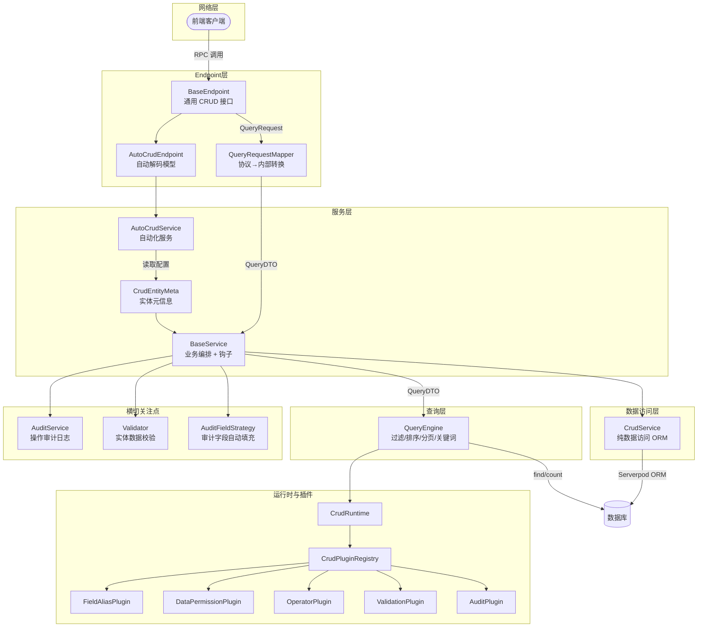
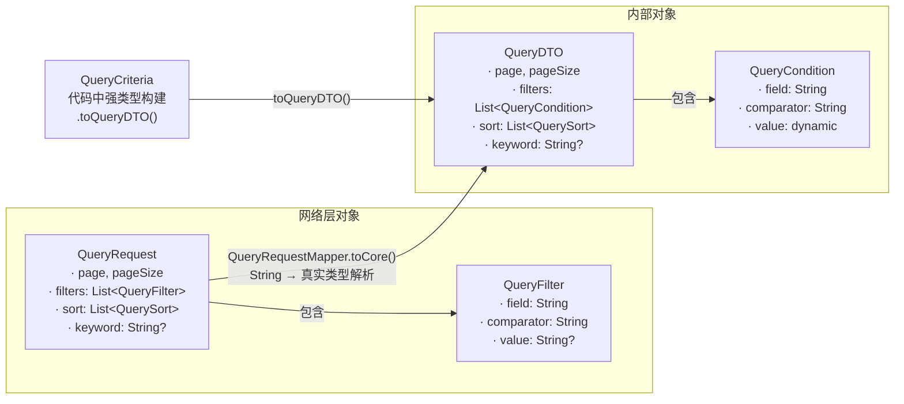
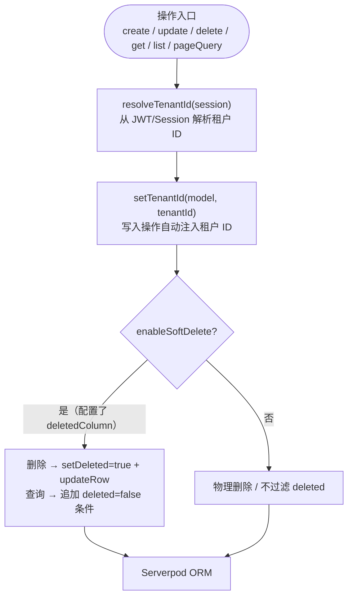
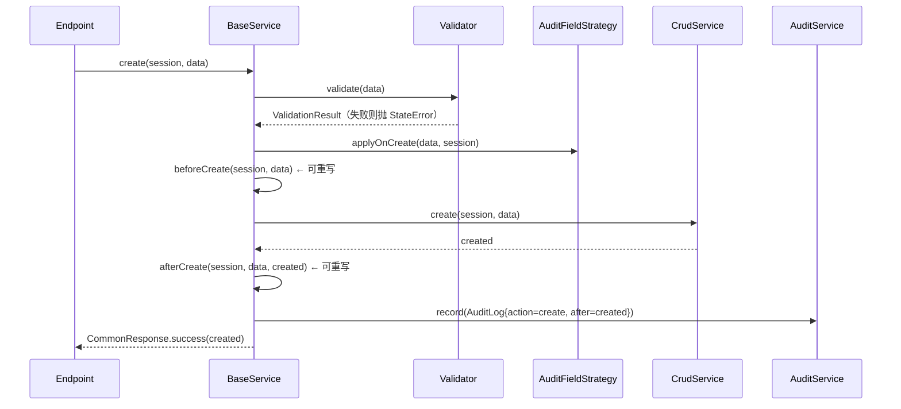
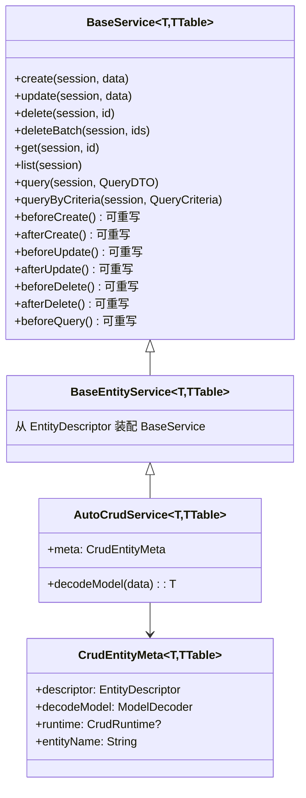
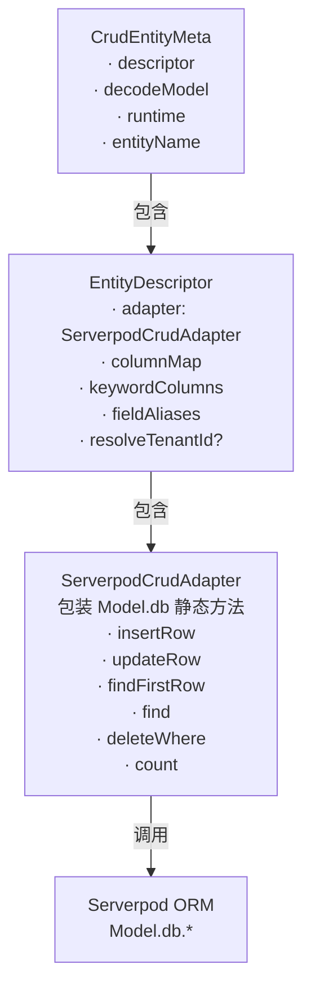
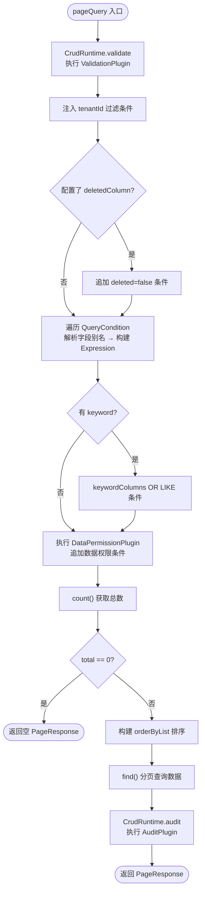
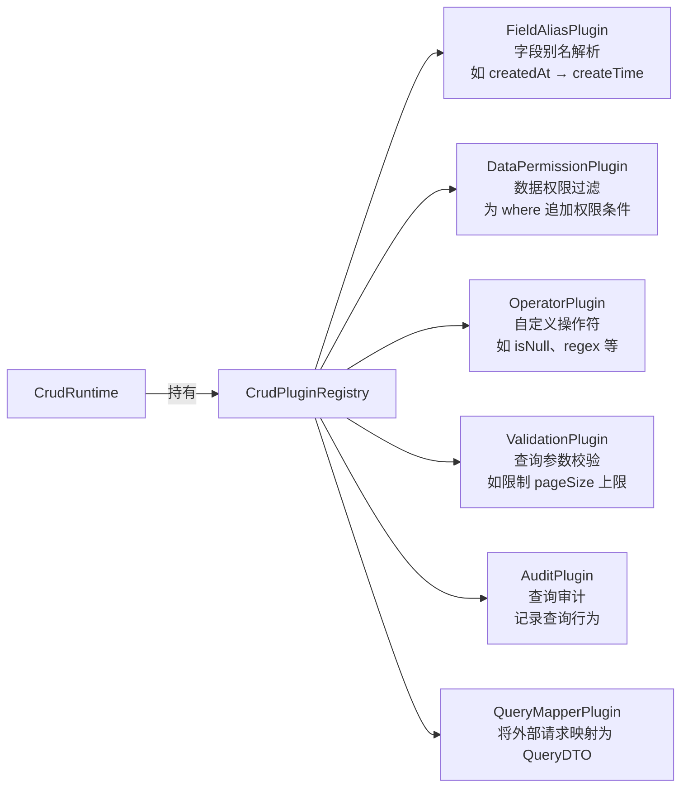

# serverpod_crud

基于 [Serverpod](https://serverpod.dev) 的通用 CRUD 框架，提供多租户隔离、软删除、分页查询、过滤排序、审计日志、校验器、运行时插件等能力，让你用极少的代码完成实体的增删改查接入。

---

## 目录

- [包结构](#包结构)
- [架构总览](#架构总览)
- [各层详解](#各层详解)
  - [数据模型层](#数据模型层)
  - [数据访问层 CrudService](#数据访问层-crudservice)
  - [业务服务层 BaseService](#业务服务层-baseservice)
  - [自动服务层 AutoCrudService](#自动服务层-autocrudservice)
  - [元信息 CrudEntityMeta](#元信息-crudentitymeta)
  - [查询引擎 QueryEngine](#查询引擎-queryengine)
  - [运行时与插件 CrudRuntime](#运行时与插件-crudruntime)
  - [审计层](#审计层)
  - [校验层](#校验层)
- [快速接入](#快速接入)
- [查询条件参考](#查询条件参考)

---

## 包结构

```
serverpod_crud/lib/src/
├── core/
│   ├── crud_types.dart         # 通用函数类型别名（InsertRow、FindRows 等）
│   ├── dto.dart                # 通用 DTO 基础定义
│   └── exceptions.dart         # CRUD 异常类型
├── crud/
│   ├── crud_service.dart       # 纯数据访问层（租户/软删/基础 CRUD）
│   ├── base_service.dart       # 业务编排层（钩子/审计/校验/query）
│   ├── auto_crud_service.dart  # 基于 CrudEntityMeta 的自动服务
│   └── crud_entity_meta.dart   # 实体元信息聚合对象
├── models/query/
│   ├── query_request.dart      # 网络传输层查询对象（可序列化）
│   ├── query_dto.dart          # 内部查询 DTO
│   ├── query_filter.dart       # 网络层过滤条件（value 为 String）
│   ├── query_condition.dart    # 内部过滤条件（value 为 dynamic）
│   ├── query_sort.dart         # 排序条件
│   └── query_criteria.dart     # 代码中强类型查询构建器
├── query/
│   └── query_engine.dart       # 查询引擎（过滤/排序/分页/关键词/插件）
├── audit/
│   ├── audit_log.dart          # 审计日志记录体
│   └── audit_service.dart      # 审计服务接口
├── validation/
│   ├── validator.dart          # 校验器抽象
│   └── validation_result.dart  # 校验结果
├── plugins/
│   ├── query_mapper_plugin.dart     # 查询映射插件接口
│   ├── operator_plugin.dart         # 自定义过滤操作符插件
│   ├── field_alias_plugin.dart      # 字段别名解析插件
│   ├── data_permission_plugin.dart  # 数据权限过滤插件
│   ├── validation_plugin.dart       # 查询参数校验插件
│   └── audit_plugin.dart            # 查询审计插件
├── runtime/
│   ├── crud_runtime.dart       # 运行时上下文（插件统一入口）
│   └── plugin_registry.dart    # 插件注册表
└── extensions/
    └── pagination_extension.dart   # 分页工具扩展
```

---

## 架构总览



---

## 各层详解

### 数据模型层

框架的查询模型分为网络层和内部层两套，通过 `QueryRequestMapper` 进行转换。



| 对象 | 用途 | `value` 类型 | 可序列化 |
|------|------|------------|--------|
| `QueryRequest` | 网络传输，前后端共享协议对象 | — | ✅ |
| `QueryFilter` | `QueryRequest` 中的过滤项 | `String?`（JSON 限制） | ✅ |
| `QueryDTO` | 服务层内部查询对象，有 `copyWith` | — | — |
| `QueryCondition` | `QueryDTO` 中的过滤项 | `dynamic`（已解析为真实类型） | — |
| `QuerySort` | 排序条件，两层共用 | — | ✅ |
| `QueryCriteria` | 代码中以强类型构建查询，再转为 `QueryDTO` | — | — |

---

### 数据访问层 CrudService

`CrudService<T, TTable>` 是纯数据库操作层，**所有操作自动注入多租户隔离和软删除约束**，不含任何业务逻辑。



| 方法 | 说明 |
|------|------|
| `create(session, data)` | 插入，自动注入 tenantId，软删时置 deleted=false |
| `update(session, data)` | 更新，校验记录存在且属于当前租户 |
| `delete(session, id)` | 软删：标记 deleted=true；硬删：物理删除 |
| `deleteBatch(session, ids)` | 批量删除，返回实际成功数量 |
| `get(session, id)` | 按 ID 查单条（自动加租户+软删过滤） |
| `list(session)` | 查当前租户全部记录 |
| `pageQuery(session, pagination)` | 简单分页查询（支持自定义 where/orderBy） |

---

### 业务服务层 BaseService

`BaseService<T, TTable>` 是核心业务编排层，在 `CrudService` 之上提供**生命周期钩子、审计日志、数据校验、审计字段自动填充**。



**可重写的生命周期钩子：**

| 钩子 | 触发时机 | 典型用途 |
|------|----------|----------|
| `beforeCreate` | 插入数据库之前 | 填充默认值、权限检查 |
| `afterCreate` | 插入成功之后 | 发送通知、同步缓存 |
| `beforeUpdate` | 更新数据库之前 | 变更校验 |
| `afterUpdate` | 更新成功之后 | 清除缓存 |
| `beforeDelete` | 删除之前 | 关联数据检查 |
| `afterDelete` | 删除成功之后 | 清理关联数据 |
| `beforeQuery` | `query()` 执行之前 | 动态注入额外过滤条件 |

```dart
class OrderService extends AutoCrudService<Order, OrderTable> {
  OrderService() : super(OrderMeta.instance);

  @override
  Future<void> beforeCreate(Session session, Order data) async {
    data.status = 'pending'; // 创建前设置默认状态
  }

  @override
  Future<void> beforeQuery(Session session, QueryDTO query) async {
    // 普通用户只能查自己的订单
    // 可在此向 query 注入额外条件
  }
}
```

---

### 自动服务层 AutoCrudService

`AutoCrudService<T, TTable>` 继承自 `BaseEntityService → BaseService`，额外从 `CrudEntityMeta` 读取模型解码器，使业务代码做到**零样板**。



---

### 元信息 CrudEntityMeta

`CrudEntityMeta<T, TTable>` 聚合了一个实体运行 CRUD 所需的全部配置，是 `AutoCrudService` 的核心依赖。

| 字段 | 类型 | 说明 |
|------|------|------|
| `descriptor` | `EntityDescriptor<T, TTable>` | 数据库适配器 + 字段映射 + 关键词列 + 字段别名 + 租户解析 |
| `decodeModel` | `T Function(dynamic)` | 将 Endpoint 入参（JSON/Map）解码为实体模型 |
| `runtime` | `CrudRuntime?` | 运行时插件上下文，可按实体独立配置 |
| `entityName` | `String` | 实体标识名，用于日志/审计 |

`EntityDescriptor` 内部包含 `ServerpodCrudAdapter`，将 `Model.db.find()`、`Model.db.insertRow()` 等静态方法包装为可注入的函数类型，使框架与具体实体类解耦。



---

### 查询引擎 QueryEngine

`QueryEngine.pageQuery()` 是查询的核心，统一处理分页、过滤、排序、关键词、插件扩展。



**内置过滤操作符：**

| 操作符 | 说明 | `value` 示例 |
|--------|------|-------------|
| `eq` | 等于 | `123` / `"active"` |
| `ne` | 不等于 | `0` |
| `like` | 模糊匹配（自动加 `%`） | `"john"` |
| `ilike` | 大小写不敏感模糊匹配 | `"John"` |
| `in` | 包含在集合中 | `[1, 2, 3]` |
| `between` | 范围 | `[10, 100]` |
| `gt` / `gte` | 大于 / 大于等于 | `18` |
| `lt` / `lte` | 小于 / 小于等于 | `100` |
| 自定义 | 通过 `OperatorPlugin` 扩展 | 任意 |

---

### 运行时与插件 CrudRuntime

`CrudRuntime` 是插件系统的统一入口，持有 `CrudPluginRegistry`，在查询时依次调用各插件。



| 插件 | 接口 | 触发时机 |
|------|------|----------|
| `FieldAliasPlugin` | `resolveField(field, aliases)` | 每次解析过滤/排序字段名时 |
| `DataPermissionPlugin` | `buildFilter(session, table)` | 构建 where 条件时，追加权限过滤 |
| `OperatorPlugin` | `name` + `build(column, value)` | 遇到未知操作符时依次尝试 |
| `ValidationPlugin` | `validate(query)` | `pageQuery` 入口，校验查询参数 |
| `AuditPlugin` | `onQuery(session, query)` | 查询成功后记录行为 |
| `QueryMapperPlugin` | `map(request)` | 将任意外部请求转为 `QueryDTO` |

---

### 审计层

`AuditService<T>` 是审计持久化的抽象接口，默认使用空实现 `NoopAuditService`（不记录）。

```dart
// 自定义审计：将日志写入数据库
class DbAuditService<T> extends AuditService<T> {
  @override
  Future<void> record(Session session, AuditLog<T> log) async {
    await AuditRecord.db.insertRow(session, AuditRecord(
      action: log.action.name,
      entityId: log.entityId,
      timestamp: log.timestamp,
    ));
  }
}
```

`AuditLog<T>` 字段：

| 字段 | 说明 |
|------|------|
| `action` | `create` / `update` / `delete` / `query` |
| `timestamp` | 操作时间 |
| `actorId` | 操作者 ID（可选） |
| `entityId` | 实体主键（可选） |
| `before` | 变更前快照（可选） |
| `after` | 变更后快照（可选） |

---

### 校验层

`Validator<T>` 是校验的抽象接口，框架提供 `RuleBasedValidator` 开箱即用。

```dart
final validator = RuleBasedValidator<Book>([
  (data) => data.name.isEmpty ? ValidationError('name', '书名不能为空') : null,
  (data) => data.originalPrice <= 0 ? ValidationError('price', '价格必须大于 0') : null,
]);
```

在 `BaseService` 中注入：

```dart
class BookService extends AutoCrudService<Book, BookTable> {
  BookService() : super(BookMeta.instance);

  // 通过构造注入（需扩展 BaseService 构造），或在 beforeCreate/beforeUpdate 中手动调用
}
```

---

## 快速接入

一个完整的实体接入只需以下三步：

### 第一步：定义 CrudEntityMeta

```dart
class ProductCrudMeta {
  static final CrudEntityMeta<Book, BookTable> instance = CrudEntityMeta(
    descriptor: EntityDescriptor.fromDb(
      db: Book.db,
      table: Book.t,
      idColumn: (t) => t.id as ColumnInt,
      tenantIdColumn: (t) => t.tenantId,
      deletedColumn: (t) => t.isDeleted,   // 传 null 则禁用软删除
      getId: (m) => m.id,
      setTenantId: (m, id) => m.tenantId = id,
      setDeleted: (m, v) => m.isDeleted = v,
      columnMap: {
        'id': (t) => t.id,
        'name': (t) => t.name,
        'categoryId': (t) => t.categoryId,
        'createTime': (t) => t.createTime,
      },
      keywordColumns: (t) => [t.name, t.author],         // 关键词搜索字段
      fieldAliases: {'createdAt': 'createTime'},          // 字段别名映射
    ),
    decodeModel: (data) => Book.fromJson(Map<String, dynamic>.from(data as Map)),
    runtime: CrudRuntimeFactory.create(),   // 注入运行时插件
    entityName: 'product',
  );
}
```

### 第二步：定义 Service

```dart
class ProductService extends AutoCrudService<Book, BookTable> {
  ProductService() : super(ProductCrudMeta.instance);

  // 按需重写钩子
  @override
  Future<void> beforeCreate(Session session, Book data) async {
    data.createTime = DateTime.now();
  }
}
```

### 第三步：定义 Endpoint

```dart
class ProductEndpoint extends AutoCrudEndpoint<Book, BookTable, ProductService> {
  @override
  final ProductService service = ProductService();
  // 自动获得：create / update / delete / deleteBatch / get / list / listByPage / query
}
```

---

## 查询条件参考

前端调用 `query` 接口时，`QueryRequest.filters` 中每条 `QueryFilter` 的 `value` 以字符串形式传输，`QueryRequestMapper` 会自动解析为对应的 Dart 类型：

```json
{
  "page": 1,
  "pageSize": 20,
  "keyword": "flutter",
  "filters": [
    { "field": "categoryId", "comparator": "eq",      "value": "3" },
    { "field": "name",       "comparator": "like",    "value": "Dart" },
    { "field": "price",      "comparator": "between", "value": "[10.0, 99.0]" },
    { "field": "status",     "comparator": "in",      "value": "[1, 2, 3]" },
    { "field": "createTime", "comparator": "gte",     "value": "\"2024-01-01T00:00:00.000Z\"" }
  ],
  "sort": [
    { "field": "createTime", "order": "desc" }
  ]
}
```

**`value` 自动类型解析规则（QueryRequestMapper）：**

| 字符串示例 | 解析结果 |
|-----------|----------|
| `"123"` | `int 123` |
| `"3.14"` | `double 3.14` |
| `"true"` / `"false"` | `bool` |
| `"[1,2,3]"` | `List<dynamic>` |
| `"{\"a\":1}"` | `Map<String, dynamic>` |
| `"hello"` | 保留为 `String` |
| `null` / `""` | 原样保留 |
 